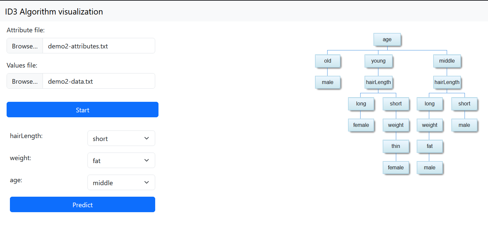

# Algoritmo ID3
## Entorno
### Tecnologías
HTML, JavaScript, CSS

### Desarollo
VSCode con plugin Live Server

### Librerías
- [Google Charts](https://developers.google.com/chart): Visualizador arbol
- Underscore.js: Funciones helper js
- Bootstrap: Framework CSS
- JQuery: Framework JavaScript

### Otras tecnologías
- GitHub: Control de versiones
- Whatsapp: Comunicación

## Implementación
### General
Se ha implementado un código de colores para poder diferenciar las diferentes casillas y sus estados. Los colores son los siguientes


### main.js
Contiene la lógica prinicpal de la página.

```
/** 
 * Data para pintar el arbol demo
*/
const demoData
```

```
/** 
 * Atributos del arbol demo
*/
const demoAttributes
```

```
/** 
 * Separa texto delimitado (CSV, etc...) y lo convierte en un array de objetos.
 *
 * @param $str - Texto que se quiere separar
 * @param $delimiter - Separador, por defecto ","
*/
function csvToArray(str, delimiter = ",")
```

```
/** 
 * Procesa los ficheros y crea el arbol usando id3
 *
 * @param e - evento form submit
*/
async function loadFiles(e)
```

```
/** 
 * Carga el modelo demo
*/
function init()
```

### id3.js
Contiene la lógica del algoritmo

```
/**
 * Generates a decision tree using the ID3 algorithm.
 * @param data - The dataset.
 * @param target - The target variable to predict.
 * @param features - The list of feature variables.
 * @returns - The decision tree node.
 */
function id3(data, target, features)
```

Una vez generado, se puede computar la lógica visual y la predicción de la variable objetivo:

```
/**
 * Generates a decision tree using the ID3 algorithm.
 * @param id3Model -The ID3 tree to visualize in the div
 * @param divId - id of canvas
 */
function drawGraph(id3Model, divId)
```

### index.html
Contiene la estructura de la página web, y contiene todos los elementos visibles de la implementación.

### styles.css
Contiene los estilos de la página web (como por ejemplo colores  y reglas de diseño).

## Ejemplos
### Demo 1 - Jugar dependiendo de tiempo


### Demo 2 - Sexo dependiendo de atributos físicos
