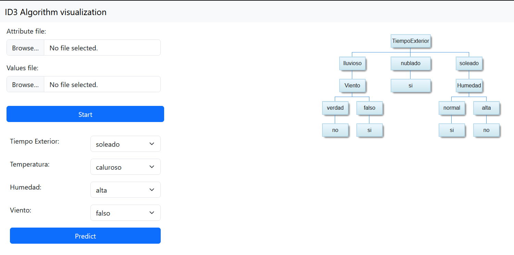

# Guía de usuario ID3
## Interfaz del usuario:

### Selector
El selector cuenta con 2 parámetros que se pueden modificar para la ejecución del algoritmo ID3:
- El fichero de atributos.
- El fichero de datos.

#### Fichero Atributos
El fichero de atributos debe tener una única fila en formato csv.

E.j. [Fichero atributos](./demo-attributes.txt)

#### Fichero datos
El fichero de datos debe tener una única fila de cabecera identica al fichero de atributos y al menos 2 filas de datos en formato csv.

E.j. [Fichero datos](./demo-data.txt)

### Ejecución

Una vez seleccionados ambos ficheros y ejecutado el programa a través del botón provisto (ambos ficheros son obligatorios) se mostrará una representación visual mediante un grafo, con la predicción realizada.

### Predicción

La sección de predicción se genera automáticamente basada en los ficheros proporcionados y permite categorizar un caso usando las reglas generadas. El resultado se muestra debajo.